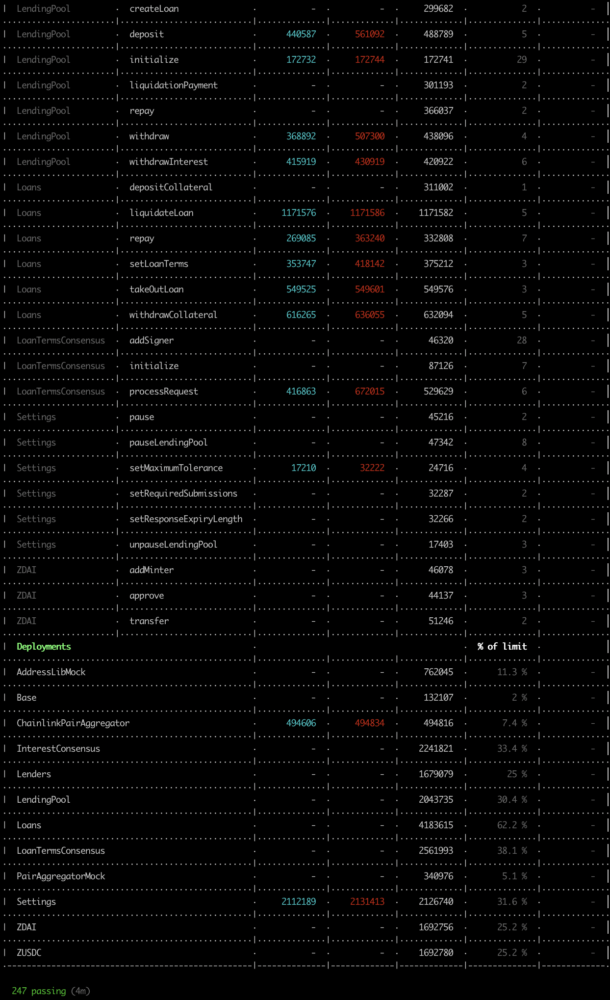
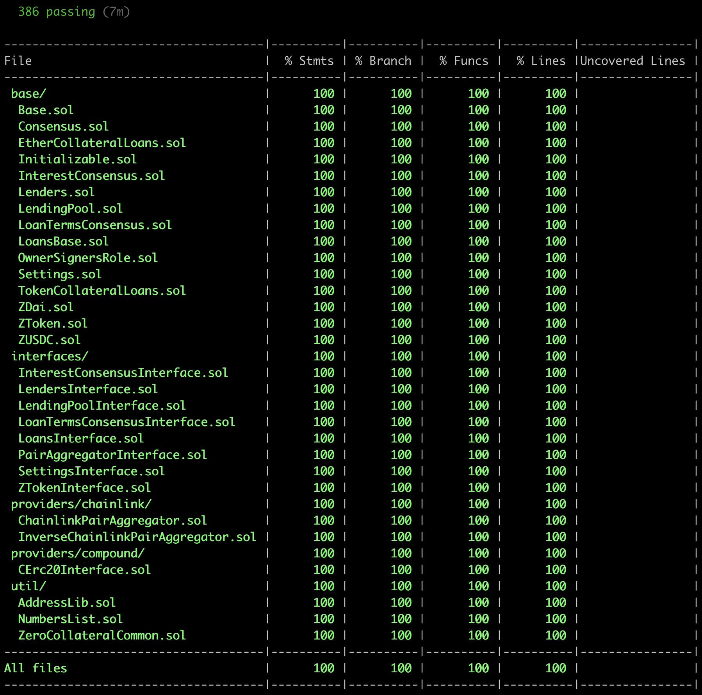

# Teller V1 Protocol

Teller V1 is a composition of smart contracts, which create the protocol. These contracts enable digital asset holders on the Ethereum blockchain to engage in decentralized, lending and borrowing activities, with down to zero collateral.

The protocol is currently in beta and deployed on the Ropsten testnet. We envision the protocol to evolve into a decentralized, community-run project, maintained by a DAO (Decentralized Autonomous Organization) structure.

To expand the possibilities of undercollateralized DeFi, we are exploring integrations with [Stratosphere Network](https://www.stratosphere.network/). Interoperability with the Stratosphere Blockchain will enable the project to tie directly into the benefits of major cloud resources while maintaining decentralization.

If you would like to contribute, we encourage you to submit a PR directly or join the open-source team at hello@teller.finance.

## Resources

* Website → https://teller.finance/
* Twitter → https://twitter.com/useteller
* Discord → https://discord.com/invite/Ujnvh8d

## Prerequisites

### NodeJS Version

To avoid any issue with the NodeJS version, please check it before continuing. It should be >= *v10.15.3* and =< *lts/dubnium / v10.21.0*.

### Install Global Dependencies

To make the development process easier, we use [Truffle](https://www.trufflesuite.com/truffle) as a dependency in the project and as a global dependency.

At this moment, the team is using Truffle v5.1.16.

```yarn global add truffle@5.1.16```

### Create a ```.ENV``` file
<a name="readme-create-env-file"></a>

You already have a `.env.template` in the root folder. Just copy/paste the `.env.template` file, and create the `.env` in the root folder.

Most of the environment variables already have a default value in the template file.

You only need to set/modify the following ones if you want to use a testnet or mainnet networks:

- *INFURA_KEY*: This is used to deploy smart contracts on a testnet or mainnet.
- *MNEMONIC_KEY*: This is used to deploy smart contracts on a network or interact with a network. **The default value is used to interact with Ganache locally.**

### Docker: Create a ```.ENV``` file

You already have a `docker/.env.template` file. Just copy/paste the `docker/.env.template` file, and create the `docker/.env`.

All the environment variables already have a default value in the template file. So, you **don't need** to modify any value.

The **MNEMONIC_KEY** value is already set because it was used to deploy the smart contract in the Ganache snapshot. So, please **don't use it** in a production environment.

### Verifying Versions

```sh
$ truffle version

Truffle v5.1.16 (core: 5.1.16)
Solidity - 0.5.17 (solc-js)
Node v10.15.3
Web3.js v1.2.1
```

> This is important to have a stable NodeJS version installed. At the moment of writing this document, the team is using the NodeJS *lts/dubnium / v10.17.0* without issues.

## Get Started
<a name="readme-get-started"></a>

To get started, you need to install the dependencies:

- Using Yarn: ```yarn install```
- Using NPM: ```npm install```

After checking the prerequisites, you are able to execute the unit tests, and code coverage.

### Running Unit Tests

Execute the command:

```yarn test```

As result, you should see:



### Running Code Coverage

Execute:

```yarn test:coverage```

As result, you should see:



## Extra Resources

- To execute integration tests follow [this guide](./docs/integration-tests.md).
- To execute scripts on Ethereum networks follow [this guide](./docs/truffle-scripts.md).
- To learn more about Teller Protocol check our documentation [here](https://teller.gitbook.io/teller-1/).

---
© Copyright 2020, Fabrx Labs
