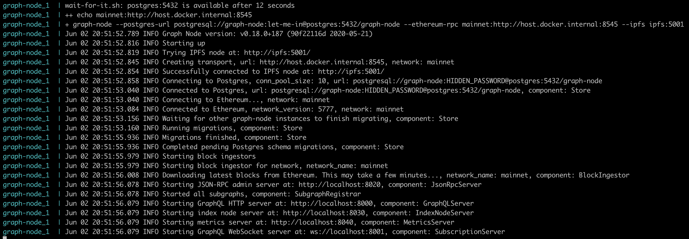
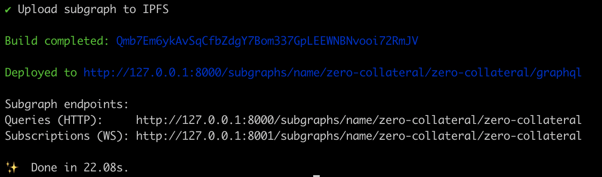
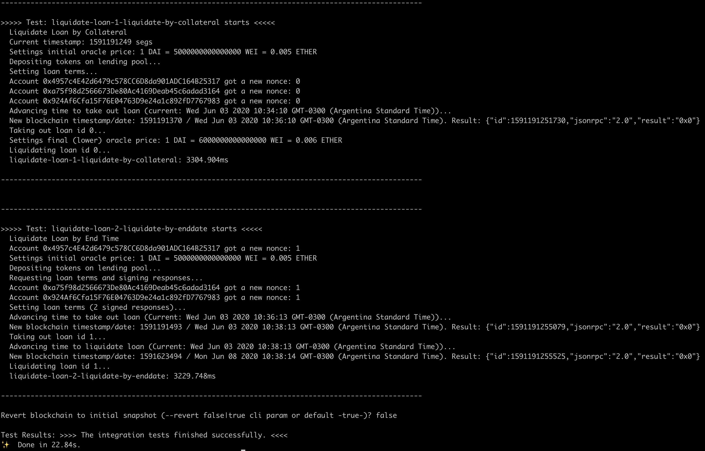
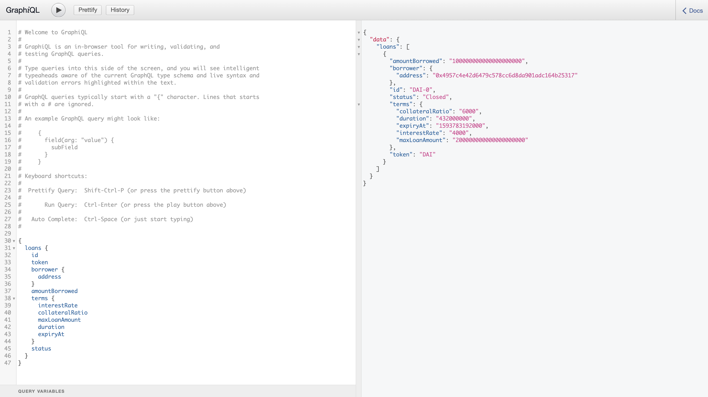

# Integration Tests

This document describes how to set up a local environment properly in order to execute integration tests.
It includes:

- A local Ganache instance.
- A local TheGraph node.
- Finally, a subgraph deployed on the local TheGraph node (see details [here](https://thegraph.com/)).

## Required Repositories

Before describing the steps, please, check you already have cloned the following repositories:

- **[Smart contracts](https://github.com/teller-protocol/teller-protocol-v1):** *This is the current repository. It contains all the official smart contracts and configuration for all networks (including Ganache, mainnet, and testnet) where the platform was deployed.*.

  - ```git clone git@github.com:teller-protocol/teller-protocol-v1.git```

- **[Subgraph](https://github.com/teller-protocol/subgraph.git):** *This repository is based on [The Graph protocol](https://thegraph.com), and listens all the smart contract events, and save the data into a GraphQL server.*

  - ```git clone git@github.com:teller-protocol/subgraph.git```
  - ```yarn install``` in the root folder.

- **[Our own TheGraph node](https://github.com/teller-protocol/graph-node)**: *This repository is used to create a local TheGraph node using a script (.sh) file.*

  - ```git clone git@github.com:teller-protocol/graph-node.git```

## Prerequisites

Before continuing with the next steps, please, check you already have completed:

- The *Get Started* steps detailed in [README.md](../README.md) file.
- The steps to clone the required repositories.

## Steps

The following steps will allow you to have:

- A local Ganache instance.
- A local The Graph node.
- Our subgraph deployed on the local The Graph node.

Finally, you will able to execute the integration tests (or scripts) on the local Ganache instance and see the data on the deployed subgraph on The Graph.

## Setup

1- Start a local Ganache mainnet fork.

> This step starts a local ganache mainnet fork from Infura. Unless you have an Infura Project ID that has access to the archive state of the node, after some time,
> trying to submit transactions will fail due to Infura. You will need to restart this process of creating a new ganache fork and deploying the contracts again.

In a new command window, go to the folder where you cloned the *Smart Contract* repository (***this repository***), and execute:

```sh
yarn start:ganache:mainnet
yarn deploy:ganache:mainnet
```

2- Start a local TheGraph node.

In a new command window, go to the folder where you cloned the *Our own TheGraph node* repository, and within **graph-node/docker** folder execute:

```sh
./run-node-graph.sh
```

> It might ask you to type your password in the starting process. Just, type your password, and press Enter.

After some seconds, you should see:



3- Deploy the subgraph on the local TheGraph node.

At the final of the process, you will deploy the subgraph on the The Graph node locally, and it will process all the events from your smart contract transactions.

In a new command window, go to the folder where you cloned the **Subgraph** repository, and in the **root** folder, execute:

```sh
yarn deploy:ganache
```

> Note: Remember you should have executed the ```yarn install``` before deploying it on Ganache.

> You might see an error in the console with the following message:
>
> ```sh
> ✖ Error removing the subgraph: subgraph name not found: teller-protocol/teller-protocol
> error Command failed with exit code 1.
> ```
>
> **Don't panic**. This error is due to the process is trying to remove the subgraph, but it doesn't exist. It is used in a development mode (when you deploy it several times without restart the The Graph node).

As result, you should see:



Congrats! You already finished the configuration!

You can visit the [local URL](http://127.0.0.1:8000/subgraphs/name/teller-protocol/teller-protocol/graphql) to access to the The Graph UI. It is very simple, but you can execute GraphQL queries to get data from your smart contract events.

Now, you are ready to run the integration tests. In a new command window, go to the folder where you cloned the **Smart Contracts** repository, and in the **root** folder, execute::

```yarn test:ganache```

As result, you will see:



Now, you can click on the [URL](http://127.0.0.1:8000/subgraphs/name/teller-protocol/teller-protocol/graphql) where the subgraph was deployed, and execute queries.



Enjoy it!
