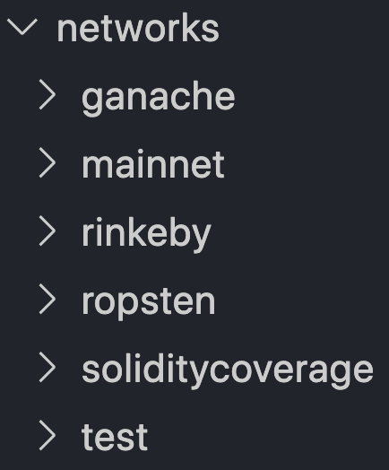

# Truffle Scripts

The truffle scripts are JS files which can be executed in any Ethereum network. You can use scripts to:

- Get data from deployed contracts, such as, pair prices using Oracles.
- Transfer tokens to another wallet/address.
- Execute specific smart contract functions.

We built scripts to execute transactions calling our smart contracts. Some examples:

- Deposit / withdraw tokens from lending pools.
- Deposit / withdraw collateral.
- List all loans or for a specific address.
- Much more.

To read more about Truffle scripts, please go to [this link](https://www.trufflesuite.com/docs/truffle/getting-started/writing-external-scripts#writing-external-scripts).

## Prerequisites

Before continuing, please make sure you checked the following items:

- Complete the [Get Started](./../README.md#readme-get-started) steps (in [README](./../README.md) file).
- Review your `.env` file, especially, the MNEMONIC_KEY variable. The scripts will use the accounts based on the mnemonic you defined in your `.env` file. If you want to use Ganache, [remember to keep the default value](./../README.md#readme-create-env-file).
- Currently, we aren't supporting all the testnets. We have a sub-folder within `/config/networks` for each network. So, please, first check whether we are supporting the network you want to use (a *teller.json* file should be within the network folder). **If the  *teller.json* doesn't exist, we are not supporting that network.**

> We are working hard to support more networks as soon as possible.

## Get Started

All our scripts are located at ```./scripts``` folder. We split them into subfolders to make it more readable and understandable.

- *account*: scripts associated with the current accounts defined in the *.env* file (mnemonic).
- *lendingPool*: contains scripts to interact with the lending pool contracts such as deposit/withdraw tokens.
- *loans*: contains scripts to list loans, repay a loan, set loan terms, take out a loan, and much more.
- *oracle*: contains a script to get data from a Chainlink Oracle for pre-configured pairs.
- *settings*: contains scripts to set/get setting values to/from the platform.

## Executing a Script

Once you reviewed the required items to execute scripts, you are able to execute it.

The command to execute a script is:

```truffle exec ./scripts/script_to_execute.js --network aNetwork --paramName paramValue```

Each script contains required CLI params. To see the required fields, just add `--help` at the end:

```truffle exec ./scripts/script_to_execute.js --network aNetwork --help```


Finally, you can execute a script passing all the required CLI params.

> The *network* param (CLI) must be a subfolder name of **./config/networks** folder.

## Network Configuration
<a name="scripts-network-configuration"></a>

Currently, we are supporting some networks defined within the folder `/config/networks`.



As you can see, each network has a subfolder. Each one has several files (protocol names) that contain the specific addresses we use in our smart contracts.
Finally, each network folder contains a **teller.json** file that has all the deployed contract addresses (*in the current network*).

> * The networks are configured in the Truffle config file. Please, see details ```./truffle-config.js``` file (section ```networks```).
> * If the contracts have not been deployed on the network you are looking for, please contact any team member.
